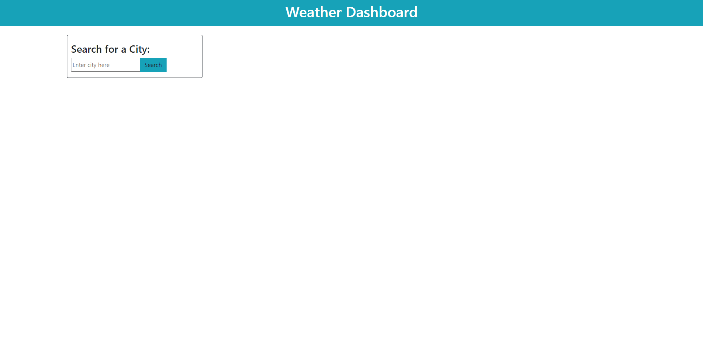
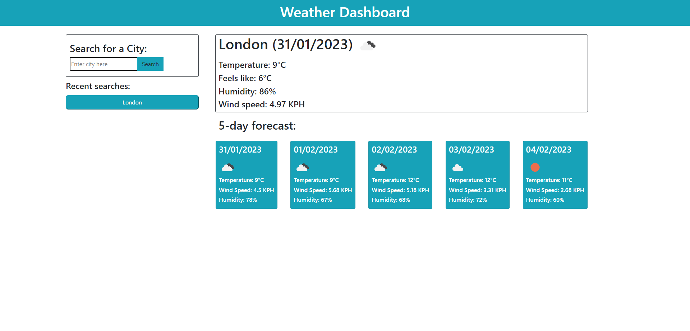
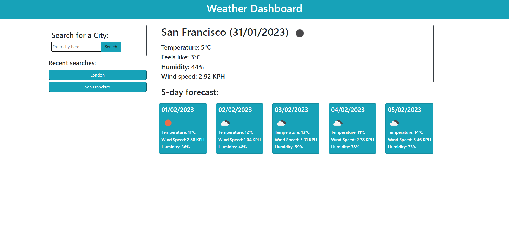
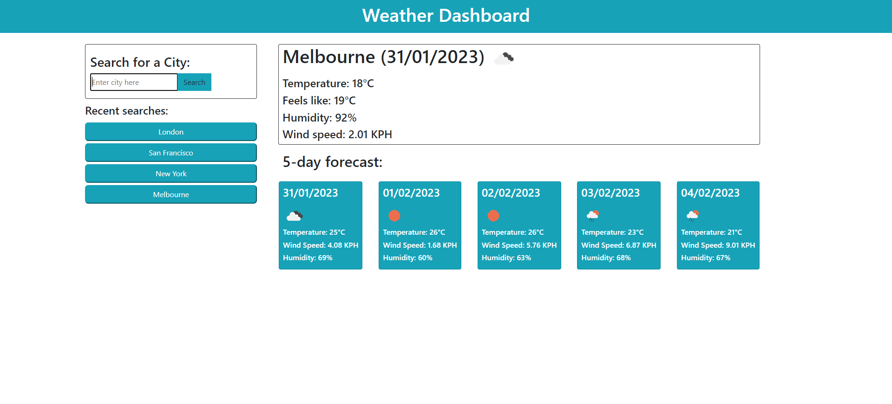

# 5-day-weather-forecast
<div align="center" id="top>
</br>

[](https://github.com//Moobell1212/5-day-weather-forecast/graphs/contributors)
[](https://github.com//Moobell1212/5-day-weather-forecast/forks)
[](https://github.com//Moobell1212/5-day-weather-forecast/stargazers)
[](https://github.com//Moobell1212/5-day-weather-forecast/issues)

</br>

[](https://skillicons.dev)
</div>
</br>


## Description

This website provides the current weather and a 5 day forecast for cities around the world using the API from Open Weather Map (https://openweathermap.org/). This site will also save recent user searches to local storage and added as buttons on the page. When clicked these buttons show the current weather and forecast for that city. The current weather will display the current date, the weather icon, temperature, the 'feels like' temperature, the humidity, and the wind speed. The forecast section will disply the weather icons for each date, the temperature,the wind speed, and the humidity.

## Table of contents
- [Usage](#usage)
- [Installation](#installation)
- [Contributing](#contributing)
- [License](#license)
- [Tests](#tests)
- [Questions](#questions)

## Usage

The page will load with only the header and the search section for the user to input their desired city as shown below.



Once the user searches a city the page will disply the current weather for the city and the 5-day forecast.



When the user further searches cities, the current weather and forecast will appear for that city, as well as a corresponding past city button under the "recent searches" section as shown below.



With future searches the above will happen, with the buttons adding up in the recent searches section. These buttons will not replicate if the user searches a city again using the search bar.



Deployed site: https://moobell1212.github.io/5-day-weather-forecast/

<p align="right">(<a href="#top">back to top</a>)</p>

## Installation

To install, on the terminal type:
```
git clone https://github.com/Moobell1212/5-day-weather-forecast.git
```

<p align="right">(<a href="#top">back to top</a>)</p>

## Contributing
If there are any suggestions for improoving this README generator:
<ol>
<li>Fork the project</li>
<li>Create your branch</li>
<li>Commit your changes</li>
<li>Push your code to the branch</li>
<li>Create a pull request in the repository</li>
</ol>

<p align="right">(<a href="#top">back to top</a>)</p>

## License
This project is licensed under the MIT license. For more information visit [https://opensource.org/licenses/MIT](https://opensource.org/licenses/MIT).

<p align="right">(<a href="#top">back to top</a>)</p>

## Tests
None

<p align="right">(<a href="#top">back to top</a>)</p>

## Questions
Contact the developer with any questions at the GitHub repository: [Moobell1212](https://github.com/Moobell1212).

<p align="right">(<a href="#top">back to top</a>)</p>
